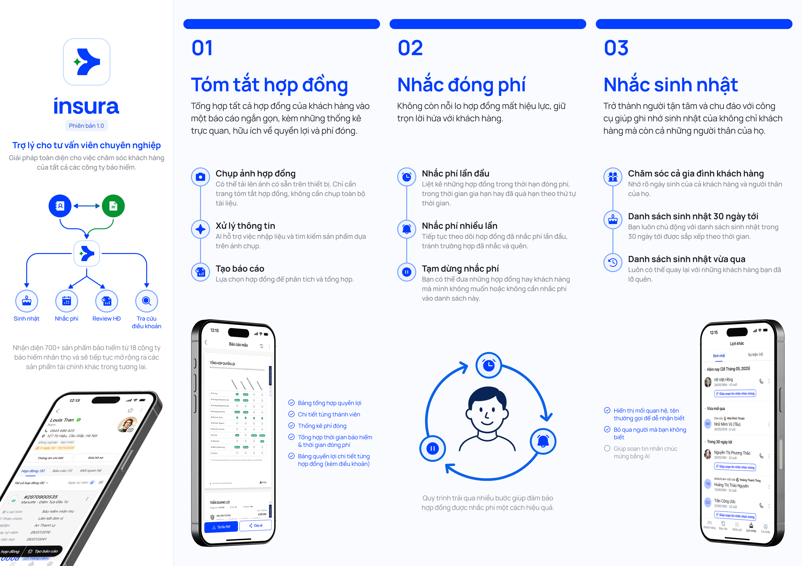

# Giới thiệu về Insura

**Chào mừng bạn đến với Insura – Trợ lý cho tư vấn viên chuyên nghiệp.**

Insura giúp bạn đơn giản hóa việc theo dõi, phân tích và chăm sóc hợp đồng bảo hiểm.

### **🎯 Mục tiêu của Insura**

Chúng tôi xây dựng Insura với 3 mục tiêu chính:

1. **Tóm tắt hợp đồng dễ hiểu:**  
   Bạn chỉ cần chụp ảnh giấy chứng nhận hợp đồng – Insura sẽ tự động phân tích, rút gọn và hiển thị quyền lợi một cách dễ hiểu.
2. **Nhắc đóng phí:**  
   Lịch đóng phí tái tục cho hợp đồng của tất cả các công ty.
3. **Nhắc sinh nhật:**  
   Quản lý ngày sinh của khách hàng và người thân, từ đó có kế hoạch chăm sóc khách hàng hiệu quả.

---

### **👥 Dành cho ai?**

Đối tượng sử dụng của Insura là những tư vấn viên bảo hiểm đang có những nhu cầu sau:

- Quản lý tập trung tất cả những hợp đồng bảo hiểm của khách hàng của bản thân hay khách hàng vãng lai.
- Tạo bản tóm tắt hợp đồng cho bản thân và khách hàng, phục vụ cho việc review hợp đồng và bán thêm.
- Chăm sóc khách hàng hiệu quả hơn với hệ thống dữ liệu được sắp xếp và tổ chức ngăn nắp, gọn gàng.

---

### **🧩 Những gì bạn có thể làm với Insura**

* Nhập & tóm tắt hợp đồng nhanh chóng với công nghệ AI
* Xem tổng quan và chi tiết quyền lợi của tất cả các thành viên trong hợp đồng bảo hiểm thông báo bản báo cáo được thiết kế tối ưu.
* Theo dõi lịch đóng phí, sinh nhật của khách hàng
* Ghi chú khách hàng, lưu trữ file & lịch sử tương tác (đang phát triển)

---

### **🚀 Bắt đầu ngay\!**

Chỉ mất **dưới 5 phút** để bạn:

1. Đăng nhập
2. Tải hợp đồng đầu tiên
3. Tạo bản báo cáo đầu tiên

👉 Đi đến **Bắt đầu nhanh** để bắt đầu\!